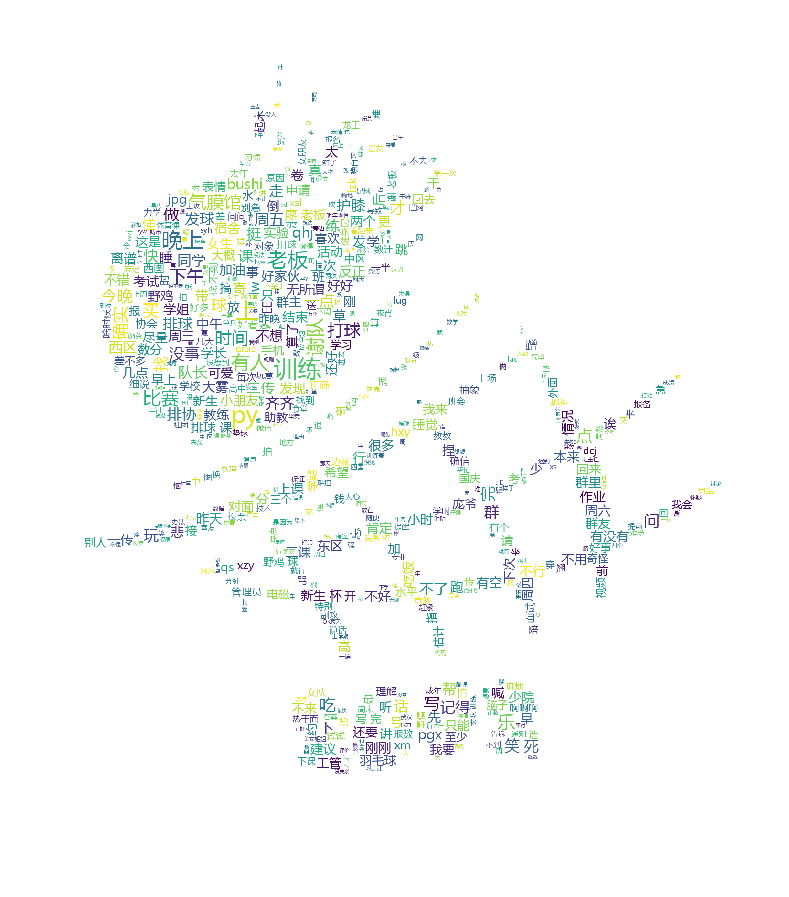

现在是 2024 年的最后一夜，但实际上前几天我已经以为是 2025 年了。最近太忙碌，甚至有些失去了时间的概念。现在，是时候正式回顾一下这一年的经历了。今年，我觉得自己经历了许多重要的变化。

<!-- excerpt -->

“变化”几乎贯穿了我的整个 2024 年。从现实角度来看，由于升学的原因，我与几位非常要好的朋友分别；因为换了校区，我也很少再见到在本部略有交情的同学。但是，对我来说，更重要的变化是离开排协，结束与两位重要人物的关系，以及勇敢面对自己曾经害怕的新事物。

## 离开排协

这种变化其实在 2023 年就已经有所预兆。第一次阅读一篇关于切割的文章时，我被自己的反应吓了一跳：我也想与身边的环境切割。

仔细回想，可能是因为 2023 年在社交中感受到越来越多的“责任”和“关系”的压力，渴望抽身而出，却没有勇气离开舒适圈。内心深处希望通过切割，丢弃一部分自己，换取更多的自由与轻松。

排协，正是我本科期间最大的舒适圈。

事实上，我并不是一个擅长球类运动的人，甚至显得笨拙。对排球也没有深厚的感情，只是在高考前一两个月开始和同学一起打球，之前也从没看过什么比赛。刚进入大学时，我只是想继续学习排球，未来和高中球友再会，还能一起打球。

排协是我大学里第一个加入的社团，也是我参与活动最多的社团。它是我主要的社交来源。虽然四年里同班的同学我可能只认识一半，但每年在排协中我都能认识很多新朋友。每周几乎都会打球，即使不打球，也会和排协的朋友们在一起。会和教我排球的学长、我带的学弟学妹们一起聚餐、喝奶茶、自习、出去玩。

我几乎无法想象如果不加入排协，我的生活会怎样。似乎没有其他的社交途径，大部分线下的朋友也都来自排协。很长一段时间，我（和其他一些群友）天天在 22 级少院新生杯的群里聊天，话题涵盖生活的方方面面，一个群基本满足了我的社交需求。为此，我还制作了一张词云，想看看大家都在聊些什么。

即便如此，我常常思考离开排协的可能性。

首先，正如前面所提，我并没有非打排球不可的理由。虽然打了这么久也觉得有趣，但由于技术原因，在科大的排球场上并没有太多的成就感。而且每次社团活动都持续三个小时，远不同于高中时下课打球那样轻松。大量的时间、本该用来解压的娱乐活动，反而让我感到更多的压力。坚持了这么久，自己也感到奇怪。

其次，我对排协的人际关系常感不适。有时候感觉关系发展得太快，容易在观念上产生矛盾。不论是与不太熟悉的人，还是与熟悉的人成为小群后，我都容易感到不舒服。

于是，在 2024 年 1 月 2 日，一个偶然的日子里，我与那时天天在一起的同学们发生了不愉快。在难过之余，也有一丝解脱，我退出了所有排协的大群和小群。寒假结束返校后，尽管名义上与小圈子的朋友们和好了，但仍未重新加入群聊，渐渐淡出了排协的活动。

在 2023 年 12 月 20 日，我在 channel 中写道：

> 下午听了许多 eva，晚上打球又被压力到了。脑子里洗脑循环 now the guilt is all mine。完蛋了。

现在回想起来，那时或许我已经隐约预感到一些变化即将发生。

## 结束两段关系

在这一年里，我结束了与两位对我非常重要的人的关系。前者的存在曾在我情绪低落时带给我快乐，每次见到她都会让我感到开心；后者在我灰心丧气时给予我鼓励，陪伴我度过了许多本来会让我感到沮丧的时光。她们都曾在我生活中占据重要的位置，前者常出现在我的日记中，后者也在我去年的年终总结致谢中。

然而，我似乎不擅长经营这种较为亲密的关系，时间一长便感觉关系发生了变化。我总是处于较弱的一方，感到一种不对等的不自在。但即使感到不舒服，我也无法轻易结束这样的关系，因为我总是怀念那些曾经快乐的时光。

经过长时间的纠结，我最终还是选择了结束这样的关系。一直沉浸在这种不平等的关系中，会让我永远迷茫，停滞不前。

## 个人成长

过去的我，是一个非常害怕新事物的人。

我害怕第一次尝试时的笨拙，害怕拼尽全力后发现自己毫无进展。因此，我很少尝试新事物，只想做自己熟悉、知道自己能胜任的事情。

在今年，由于不再频繁打排球，社交圈也有所缩小，我有了更多的时间。如果不从过去那个不敢尝试的自己做出改变，会非常空虚。

于是，我尝试了许多新事物：看书、学吉他、学日语、旅游。

同时，在技术方面，由于形式所迫，我不得不勇于尝试，也取得了一些进步：全力完成了毕设的 Vulkan 程序，写了一份实验结果和解释能让我自己信服的毕业论文，速成了许多 AI 相关的技术，阅读了比往年多很多的论文（以前一看到这么多字就害怕），勇敢地离开了一个话题不感兴趣且有些怪的公司，回到学校换课题重新开始科研。这些都是以前我还没尝试就会认为自己做不到的事情。

## 总结

提到一年即将结束，我的第一反应是“又是一无所成的一年”，但仔细回想，我觉得 2024 年的自己比 2023 年有了很多进步。遇到了许多困难，但都一一克服了。我在不断变得更好。

这一年，我在各个方面都经历了许多变化。在这个过程中，我失去了原本的社交舒适圈，却收获了内心的平静与轻松；失去了对一成不变的安心，但也体验了更多的新领域，学会了新的技能。

2025，你好。
