记录本研一新生，应大四的中学同学邀请，逃了周一周二的满课，在黄山旅游的故事。

<!-- excerpt -->

## 起因

正大四立志一年走遍黄山和五岳的哪吒同学在双十一突然和我来了句：

> 去爬黄山不？

本质非常宅的我几乎从不会规划旅游，正巧没人拉我去过黄山。一时也无要紧事，于是一声应下。

然后我便在完全看不懂地图也没仔细调研的情况下，一路“我觉得都行啊”的默认安装方式，与对方定下了这场两天一夜的黄山之旅。

先放出我们的最终路线：

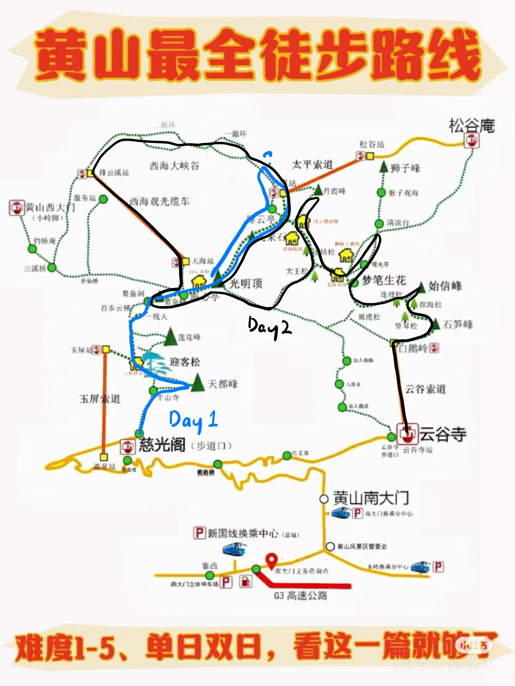

## 周日：出发! Go Hiking!!!!!

原定的行程中，周日预计到达黄山脚的旅馆。正好高新区的室内排球场使用时间是周日上午，我便先打了一早上排球（松弛x1）。结束后和我曾经的排球教练学长们在路边宝藏小店美餐一顿，又逛了一圈龙湖天街（松弛x2），赶回宿舍最后确认了一波行李，打了个拼车去合肥南，时间卡得刚刚好（松弛x3）。

在去黄山的高铁上，与邻座的姐姐聊了起来。知道了对方是黄山本地人，却因为疾病未能在高三毕业时实现同龄人一起爬黄山的当地传统（应届毕业生免票），又因在大学校园内被一位刚拿到驾照的老师撞到、留下残疾，终生难以攀爬陡峭的黄山；听闻了她的高考成绩（不低了，630+，数学138）与遗憾（比如解析几何题目用平面几何方法做，但似乎没有给分。说实话我也喜欢用平几做，中考也遇到了使用其他解法被扣分的事，真的共情了），成为保研的第一批专硕后相关政策的不完善与同学间的友爱和黑暗；也听说了她最早的工作在哪以及抽象的领导、同届同组员工辞职了一半、最后求稳定，回到家乡的黄山学院做计算机老师；她的朋友中去几家大厂干过的都最终回到了稳定的工作，因为真的存在优化老龄的情况。还有老生常谈的话题，她做软件安全测试，也有着对学术和未来的迷茫。她说知道周围人的论文都是怎样造出来的，也知道 ai 该如何灌水，可还是不太喜欢。我也分享了我的经历，黑公司、CAD、图形学、迷茫。她还问我有没有参加前段时间在黄山的 PG……总之，聊得很舒服，像同龄人。

飞速的 2h 过去后，来到了黄山北站，与仍然那么爱说四川话的哪吒同学会合，到宾馆吃完饭随意叙旧与向老板问路后 21 时便睡下了。我笑自己是傻逼，还带了个平板装模作样要学习，根本用不上。可睡前在开 Hackergame 发展的讨论会，竟然真用上了平板……

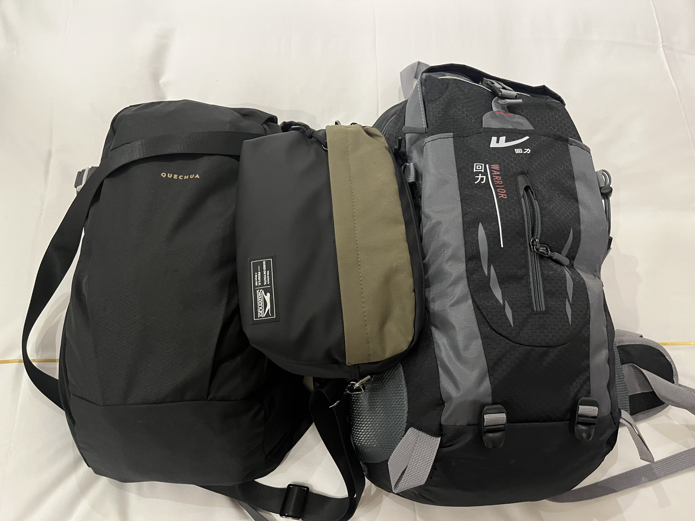

## 周一：天都峰、光明顶、还是光明顶

### 新手村

出发前我已收到刚去过黄山的 Z 学妹的忠告：

> 从南大门直接上天都峰你会死的，我们上次从天都峰下山就遇到那些从南大门爬上来的，他们已经手脚并用四肢着地地慢慢挪上去了。

但因为我调研不足，以及还是看不懂地图。在山下哪吒同学问了我好几遍索道还是爬，感觉她比较想爬吧，我也一时纠结。突然想着，咋还没开始累就坐车了，不行不行。于是说：“那先爬呗？”

然后还没到检票口就累成傻逼了🤡，这会有一位天天爬黄山的老爷爷总是刷新在我们面前，鼓励我们再多走几步、前面多少路就有可以坐着歇的了。同时因为他比我们走得慢，所以我们边歇边走还能老和他会合。好有一种新手村 NPC 的感觉。

### 天都峰

不管怎么说总算到去天都峰的岔路口了，老爷爷不爬天都峰，与我们分开。这也说明我们已经出了新手村，合理。

但进了天都峰，这和我想象中的爬山不一样啊喂，爬山不该是上几级就是一片平地，偶尔下几级吗……就算陡也应该是连着很长上楼梯这种，或者楼梯稍微窄点吧。

这超长超窄左右镂空绝壁云梯是啥玩意：

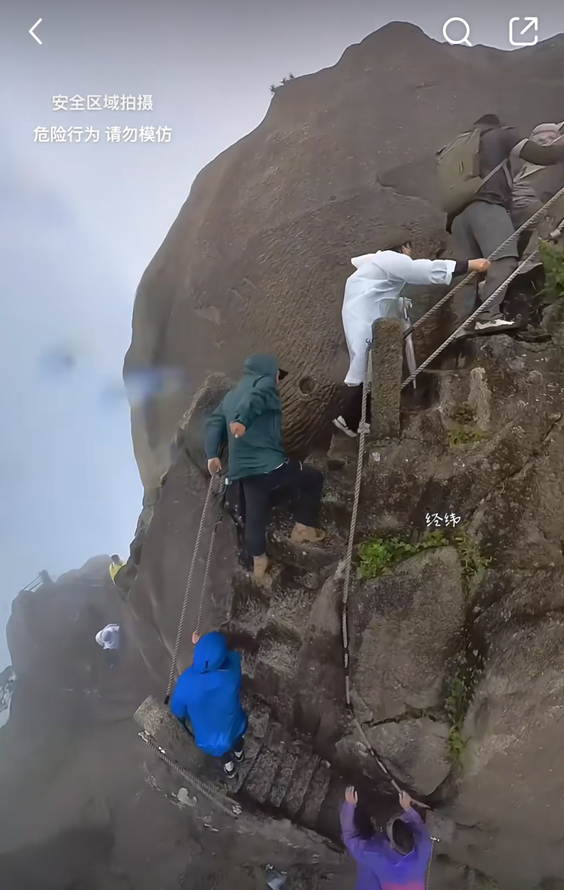

这四五级台阶就比我高的超高台阶又是啥玩意：

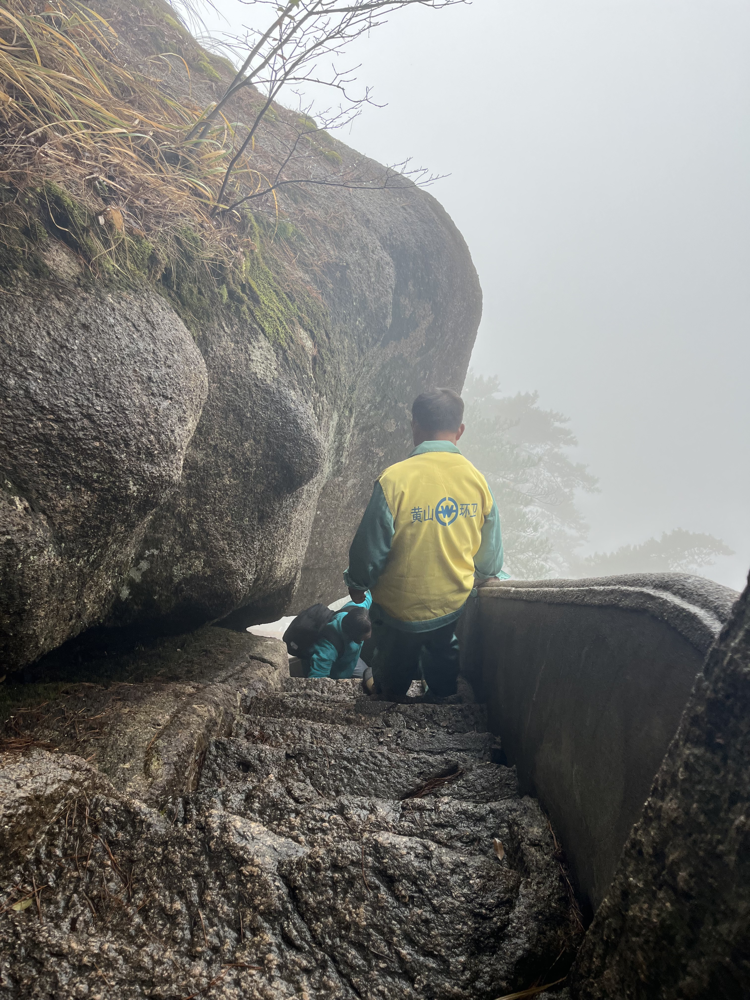

带着两根登山杖的我真有点感觉自己是傻逼了，这山根本不支持四足行走，难怪那些人真用四肢爬的，台阶这么高可不抓着更容易吗……

后面我切换成了三足行走，一根超短登山杖，另一只手抓旁边的石壁坑或绳索。根本不太敢拍照，太可怕了。

在某个较大的休息区域帮哪吒同学拍照时被嫌弃了qaq，认识了主动请缨帮忙拍照的晓妹和雨哥，也拍下了第一张山上的合影。雨哥非常豁达的样子，穿着一身鲜艳的洋红色冲锋衣，挂着头戴式耳机，还有一副墨镜😎。哪吒同学夸他这一身好适合拍照，他便举起双手说：“来借吧！要借哪些！都借你拍！来都来了，开心最好呀！”，让我大脑过载了几秒。晓妹也突然这样了：“我的也可以借！”，然后哪吒同学还真借了哈哈哈😄。

爬天都峰最险的一段路，手环的自动记录运动帮我记录下了 50 min 的无氧运动，然后很突然地登顶了。可惜雾海茫茫，啥也看不见。我们也没带什么适合拍照的东西。但又突然出现的雨哥一行人带着红旗，又大喊着“想借什么就去借呀，开心最好！”，鼓励着我们借了红旗。

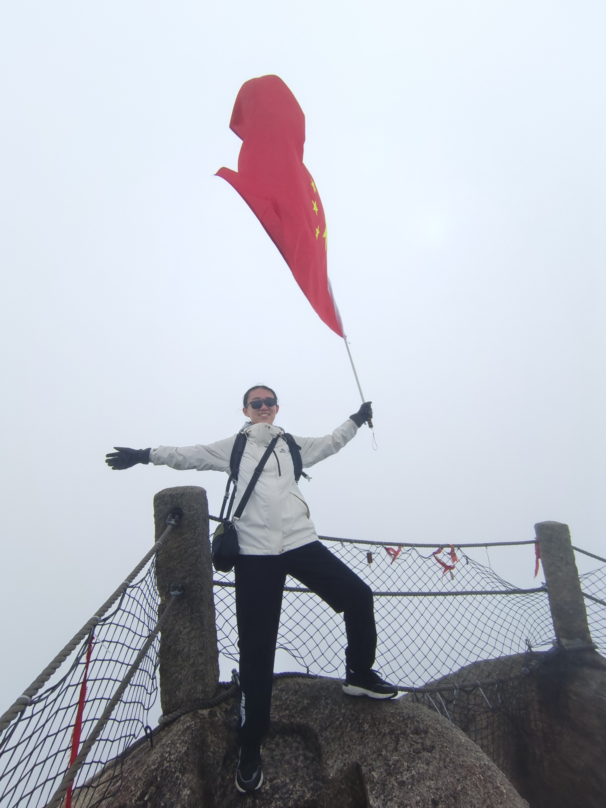

之后就是从另一条路下天都峰，这时我隐隐反应过来“原来这种群峰和老家的山不一样，不是闷头爬到顶就结束了。想要去每个顶，就得上上下下很多遍”。我又有点感觉我是傻逼了🤬。

下天都峰的路比来时简单许多，至少少了很多那种超大份台阶，长台阶还是绵延不断。有个叔叔一路往下跑并和周围人炫耀自己爬过很多山，不虚这种下山路：“哈哈看我，我从来不用登山杖！”，嘛也不知道是不是真的铁膝盖。我们就老实跟着人群，听着周围人的低音炮放着流行歌曲，高潮部分许多人在跟着唱。放到了我弹过记得谱的曲子，但不会粤语，于是我全程 555554345、556332123 地唱着。

### 光明顶

下到了玉屏，也就是第一个索道的终点、天都峰和光明顶相连的最高平台。我们暂做修整与简单午餐，准备上光明顶。

哪吒同学：“你就带了三条巧克力？！！”

我：“啊对，我怕我背多了爬不上去，倒不如去山顶氪金了🤡。”

然后哪吒同学和我分了一条火腿和一块小面包。

这时又遇到了晓妹，她拍了拍我们打招呼，知晓了她也准备去光明顶，加了个微信，约定着山顶见。突然晓妹问我们食物多么，然后拉着雨哥和我们分了好多零食，说他们带太多了。还是好人多啊呜呜。

去光明顶的路轻松很多，和普通的山就没多大区别。路上看了著名的迎客松，可是我看很多松树都像迎客松；圣地巡礼了二年级课本提到的仙人指路，还看见挑夫在逗三年级的小妹妹，问会不会背那篇，小妹妹真大声背起课文；走了一线天，但我们都记得天都峰好像也有个一线天，不知差别。

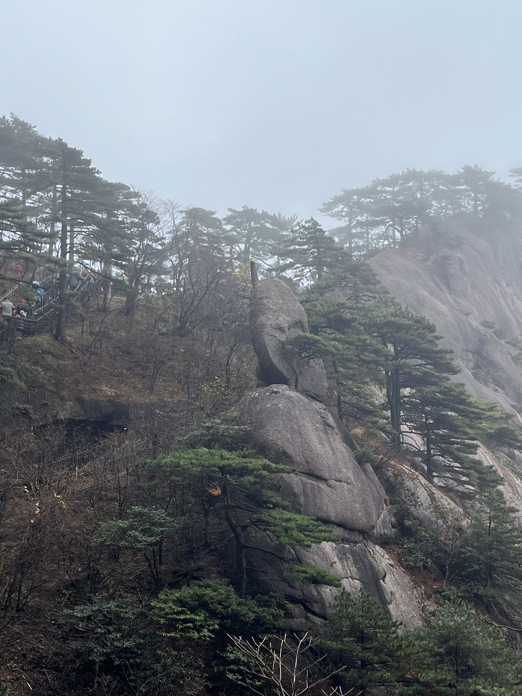

下午三点多来到了光明顶。

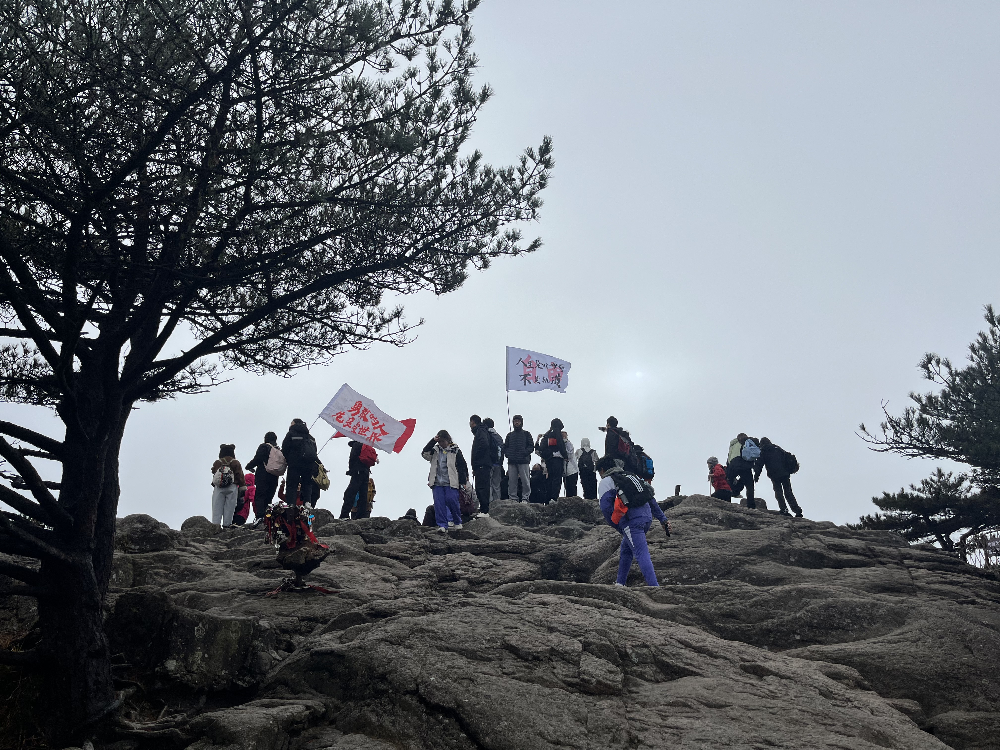

### 还是光明顶

三点多登顶了，得给自己找点事做啊，总不能窝一下午晚上宾馆吧。我和哪吒同学又出发向飞来石方向探索。

应该是太阳将部分雾气照散了，天气较好，这一路上风景都挺好的。

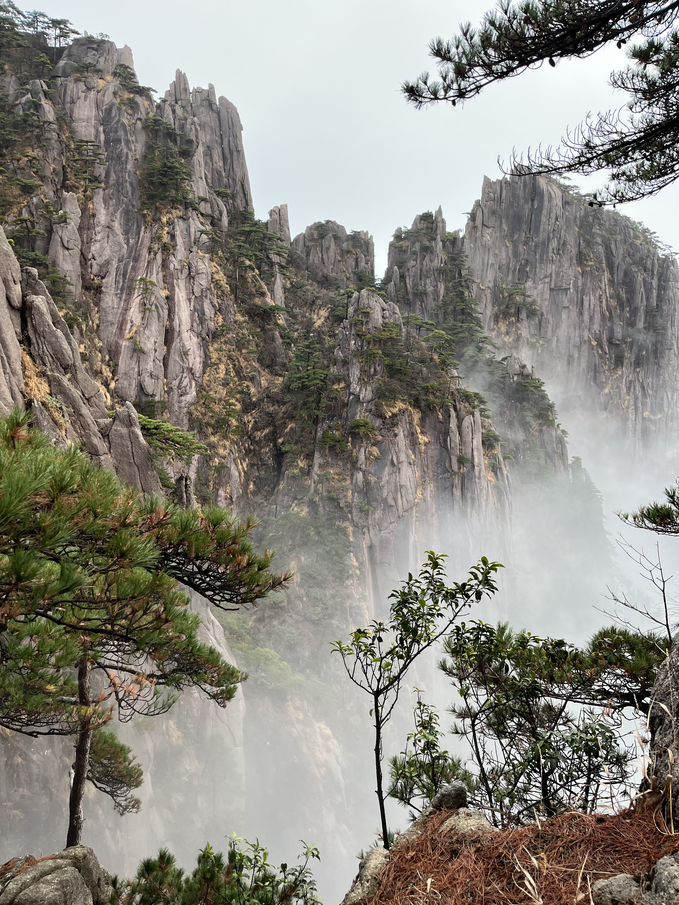

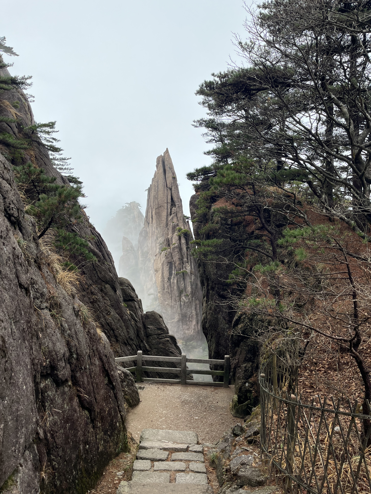

在这条路的观景台帮哪吒同学拍了很多照，正要打道回府了。诶，又遇上了雨哥。

我们交流了行程，发现住的宾馆很近。他说你们都沿着飞来石走了，不如继续往前走去西海大峡谷，再坐小火车上来。这是我们第二天准备去的地方。在他的建议下，我确实觉得来回走回头路很亏，不如一条路走到尽头。哪吒同学有点谨慎，担忧赶不在小火车下班（17:30）前到达谷底。雨哥说，诶，没事，下山诶，还有一个小时是吧，肯定来得及啊。我说，诶，没事，咱住得这么近，真寄了晚上一起爬楼上来（松弛x4）。

于是我们跟着雨哥一路快走带跑，遇到好的风景赶紧抓拍两张便继续赶路。跑了可能十几二十分钟吧，终于遇上了长下山楼梯。雨哥无所畏惧，还是一路小跑。我和哪吒同学已无力跟随。本来便与雨哥有一段距离，这回真来不起了。

我：“咱还是上去吧。”

然后我俩灰溜溜重新上山，下山不到半小时便是上山的噩梦。我简直是四肢行走，很大程度用登山杖往上抬自己。六点多终于重新来到了山顶的宾馆。这一路我一直在安慰咱，诶没事快了，诶你看这个路标不就是咱往下跑的开始吗，诶这里风景还不错，不亏了。其实我知道我确实傻逼🤡。

### 夜晚

吃光光了雨哥送的小零食，洗完澡，20 时整就睡了。在 18 时多发现雨哥加我微信好友，关心我们坐上车没，怕害得我们再走三小时回山顶。他是真的快啊，17 时就到谷底了。这时我只夸他强大，但还没有体验到到底有多强。

哪吒同学晚上起了很多次想要看山顶的星星，但都没看见。

## 周二：日出、西海大峡谷、三上光明顶、下山

### 日出

前文提到，哪吒同学等了一整晚星星。她看着雾气渐渐散去，充满期待；结果快到日出的时间，又是雾气弥漫了。我还在洗漱，她已经从外面绝望地回来了。

在我吃完早饭时她已经迫不及待想离开伤心处，启程去西海大峡谷了。我也正想发一条 channel 吐槽：什么日出嘛，全是雾。

打字时天边突然有了一条更亮的颜色，然后以肉眼可见的速度日出雾散。没想到给我们看上真的黄山日出、云海缭绕了！

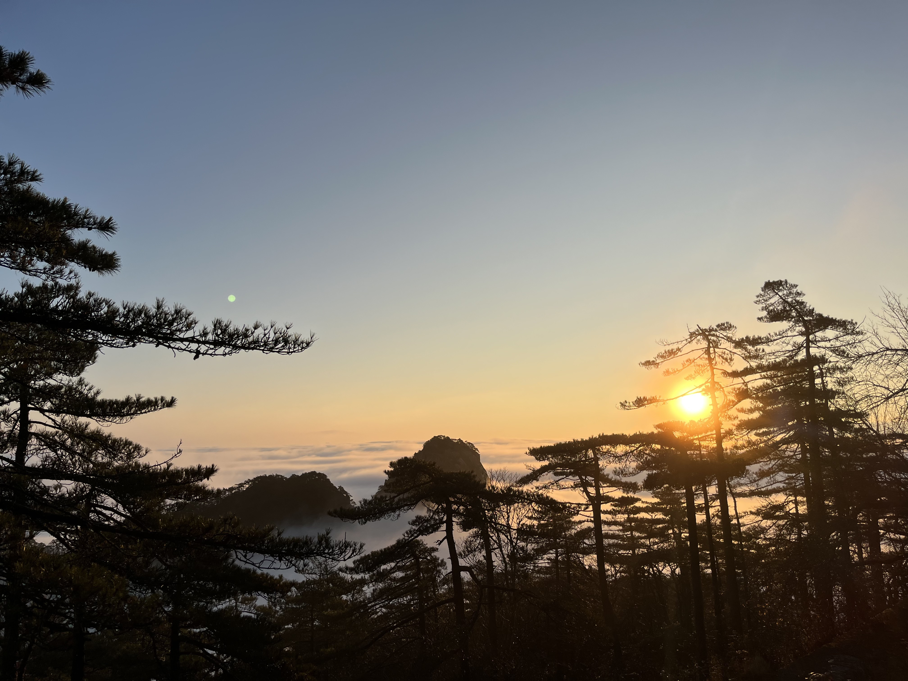

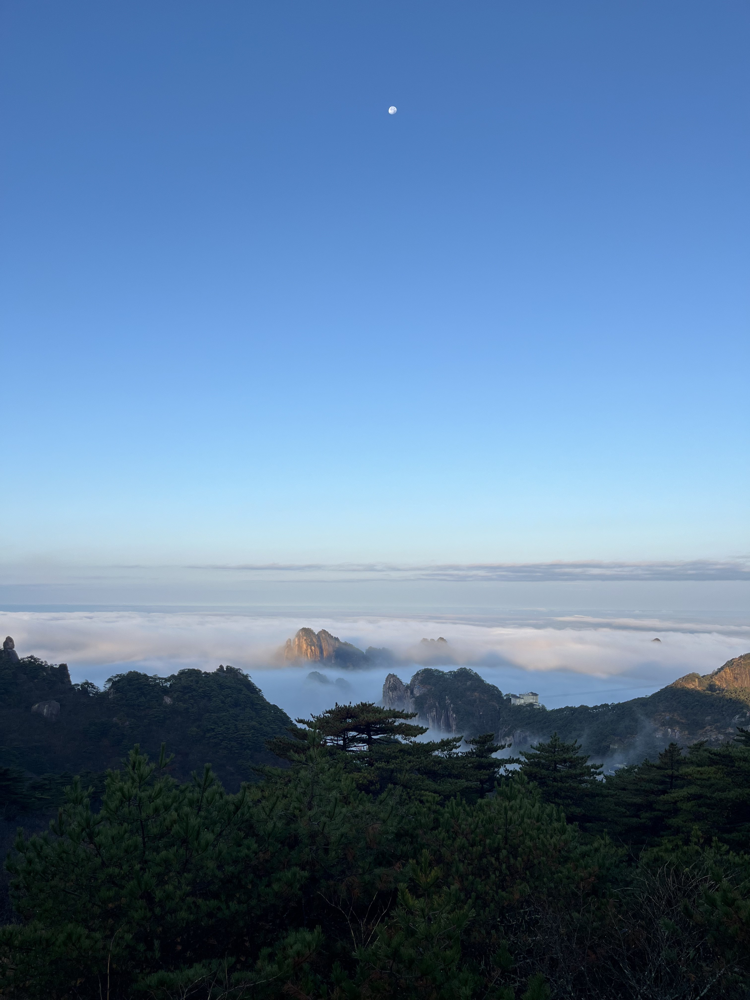

### 西海大峡谷

怀着激动的心情看完日出，7 时整我们离开。哪吒同学一路喊着“好看好看！”，我们奔向西海大峡谷。这条路上高海拔的地方确实甚是美丽，是我喜欢的云雾缭绕、苍劲的山。咱跑好快，几分钟前还看着山下一段距离的某处，不待多时就真的跑到了。边跑还听见有人在“啊啊啊”地对着峡谷中云海喊叫，然后我们也喊，很快其他地方又有人喊。两岸猿声啼不住。

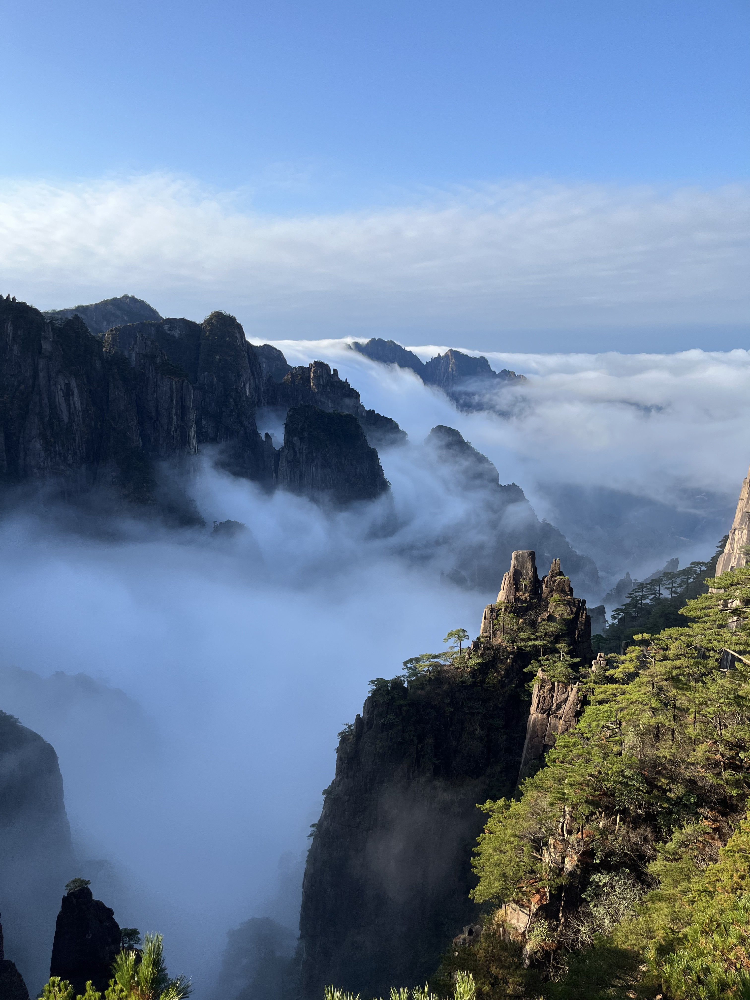

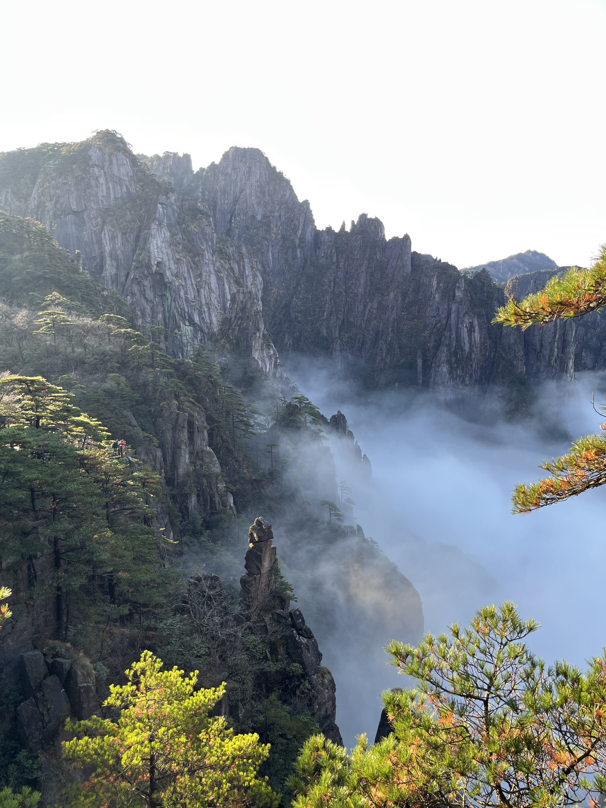

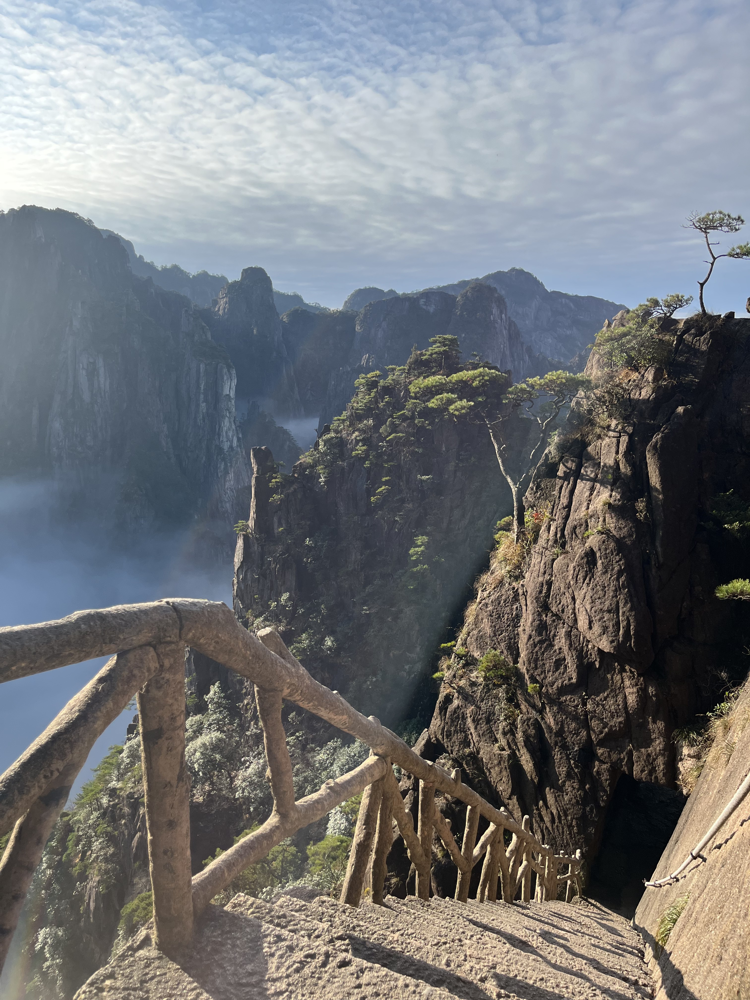

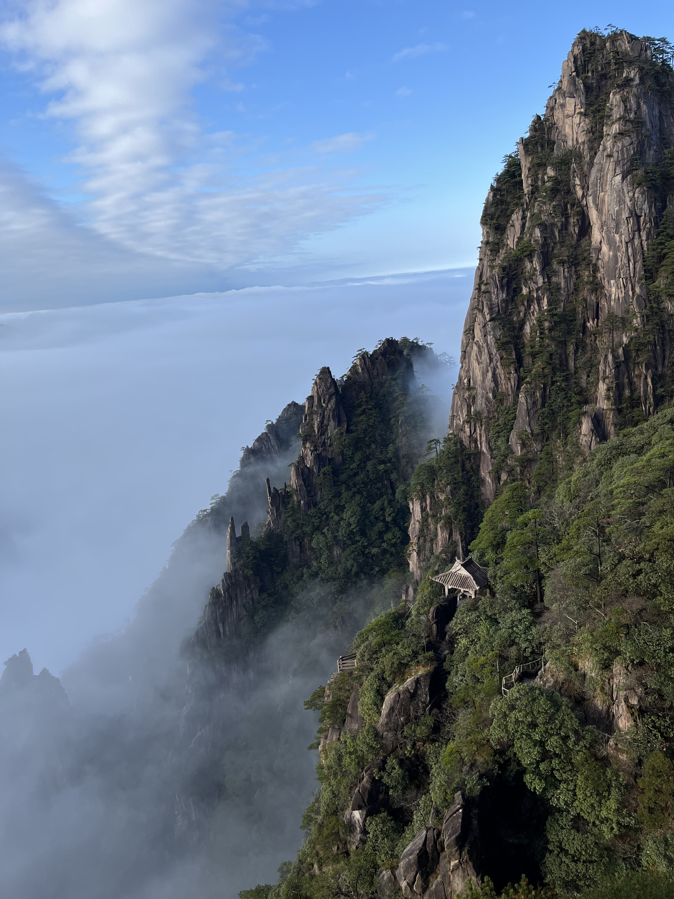

可跑到接近峡谷底，又感觉四处全是雾了。遇到每一个挑夫咱都问还有多远，大伙都说快了，但真要下楼梯下绝望了。有个挑夫说“我的话，半小时到底吧”，后面想想有点点吹牛逼了xs。

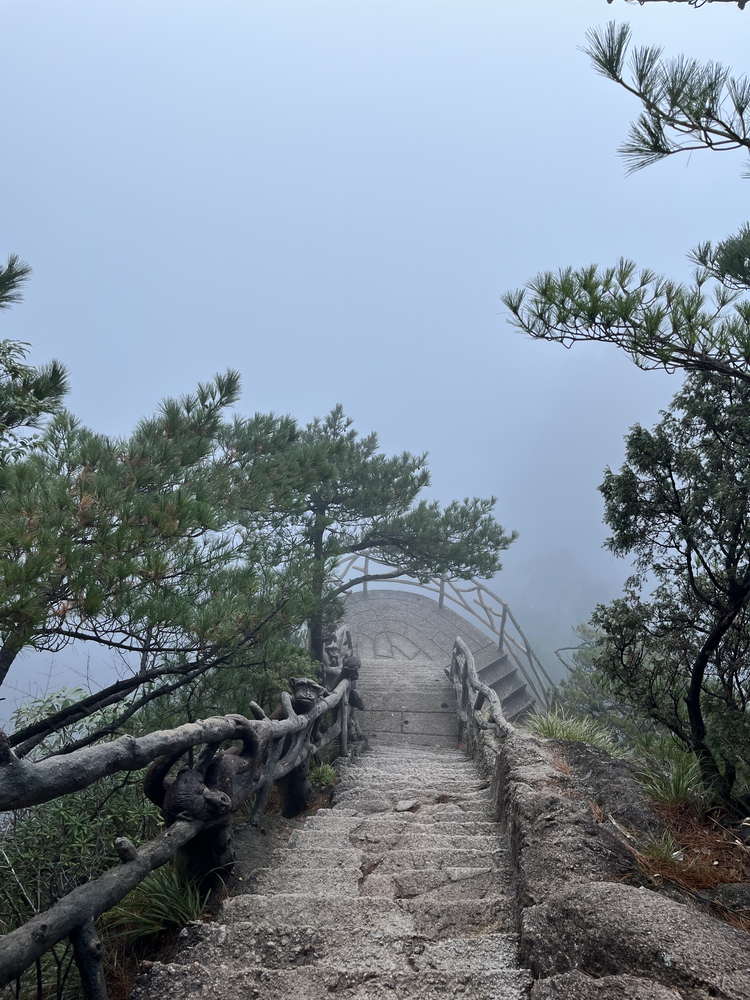

8 时 45 分，我们到达西海大峡谷谷底，乘坐了网红小火车上山。小火车就没意思了，什么都没看见，但咱也没能耐原路返回三小时了。

### 三上光明顶

上山后哪吒同学还有许多力气，而我已疲倦。我们上了鳌鱼峰，拍了几张同样很好看的照片后，突然雾气在 1 分钟内弥漫全山，又回到昨日的状态了，什么也看不见。但为了从后山下山，我们又上了光明顶，第三次了（战术后仰）。

再后面的景色我已觉得平平无奇，特别是经过猴子观海时，总感觉有点像骂人了。一路上咱也问下来的路人上面有啥，都很幽默，说“有啊！雾啊！”。我脑中出现一句，“猴子观海：猴子是人，观的雾海”。

去下山索道的路上只需绕路 20 分钟便可去猴子观海和狮子峰，我实在不行了，在路口等待哪吒同学。她下来后我问看到了什么，她说：“雾和标志牌啊！”。

哈哈，不信邪吧。

### 下山

去下山索道的路上我们仍然一路问着距离，哪吒同学吐槽，“爬黄山的人说的‘快了快了’，都是二十分钟起步。可我想的‘快了’应该是五分钟内，最好我直接能看到。”

我：“你能看见，就不会问了吧。”

哪吒同学觉得很有道理。

期间我不小心问到了一位老外，她说：“Sorry？”。我心喜，准备展示我作为 985 本硕的高超英语能力。我的脑中实时构建出了句式，“How long will it take me to ...”，可是“云谷索道”该怎么说来着！我呆住了，老外看出了我的窘迫，开朗地说着“Yeah, yeah”并挥着手，原谅了英语学艺不精的我并走掉了。0 胜 1 败。

还有个叔叔骗我们说还有一两个小时到索道，他的同行人们批了他一顿😄。

这一路全是雾，下索道更是什么都看不见。

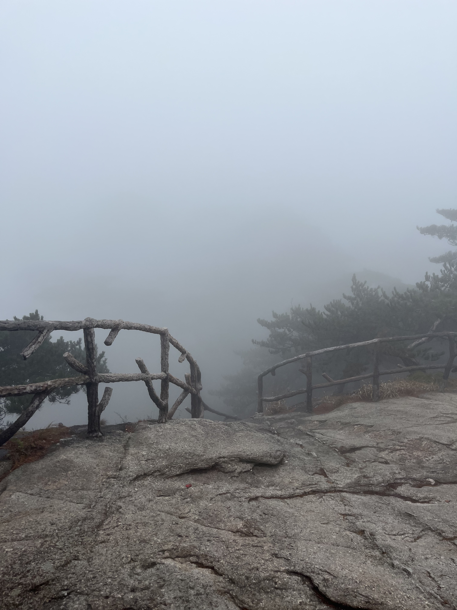

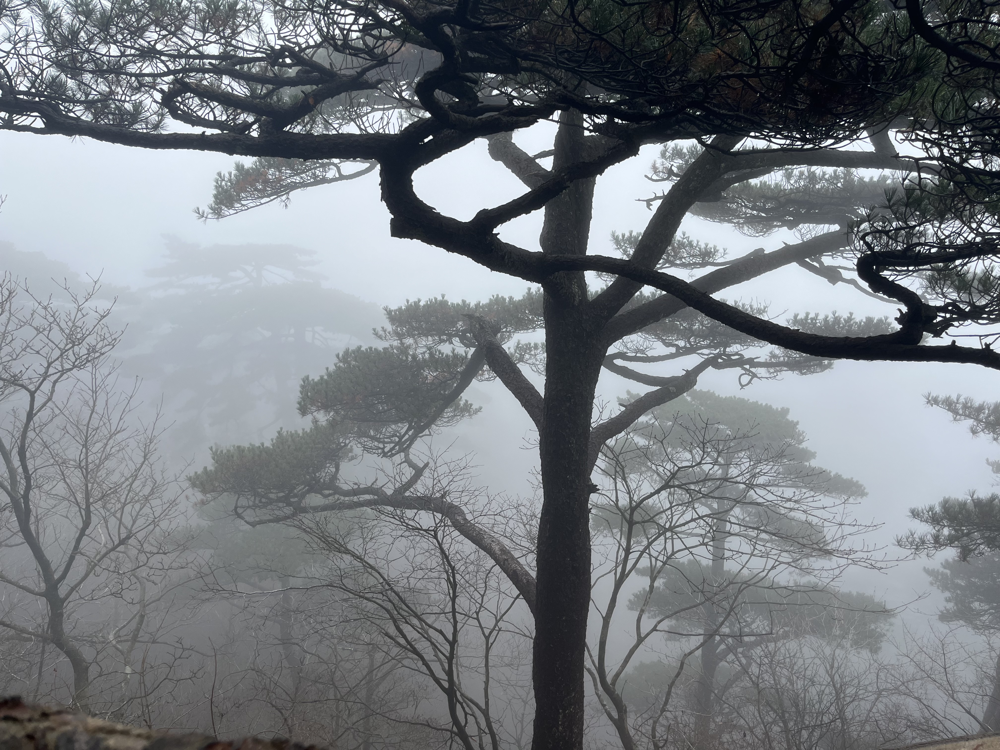

## 一抹奇幻色彩？

- 下山后咱被老奶奶追着卖茶叶，我大喊着“我家卖茶叶的，你别卖我了！”，她真就不烦我了。
- 下山比预计早，我们改签提前了车票。可是哪吒同学走后，我在等车时，LED 屏幕和广播都坏了。我看了好几遍也一直显示我的车没到。实在绷不住去问了工作人员，才知道所有公告装置都坏了、他们在检票口人工吼什么车到了、一堆人都挤在唯一的检票口前问“错过车咋办啊”、最重要的是我的车刚走。RMB -140，在 12306 点了个投诉不知道会不会有结果……
